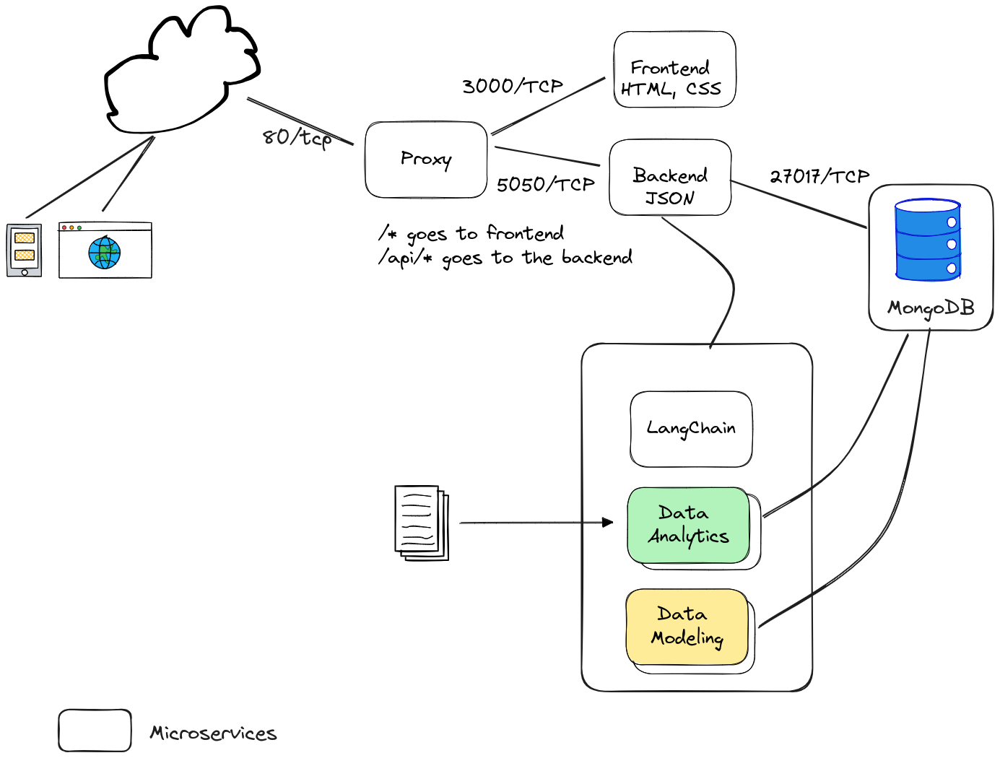

# lp-toolkit

`lp-toolkit` is a project aimed to help developers get started with ML/AI development. It is both simple and flexible in its design and implementation.  

The project's goals include:

- Configurable and plugin architecture to allow adoption of evolving technologies
- Rapid instantiate and deploy a robust AI/ML development environment
- Utilize existing OpenSource tools - why reinvent the wheel?
- Self-contained containerized microservices - batteries included!

## Architecture



## Getting started

Out of the box, `lp-toolkit` uses the ChatGPT engine, an OpenAI API key is needed.  To get started quickly, we assume that you have the following installed in your system:

- `npm`
- `docker` and `docker-compose`

The first step is to compile the frontend:

```bash
cd lp-toolkit/frontend/
npm install
```

Next, compile the backend:

```bash
cd lp-toolkit/backend/
npm install
```

Finally, start the `lp-toolkit` system:

```bash
cd lp-toolkit/
export OPENAI_API_KEY={replace-with-your-openai-api-key}
docker-compose up
```

Point your web browser to `http://localhost:3000`

And you should see the following screen:


